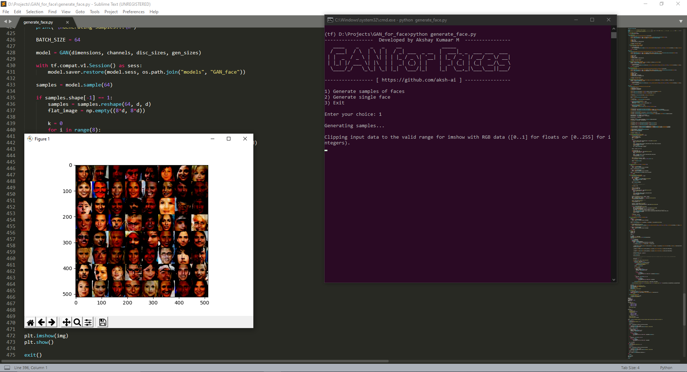
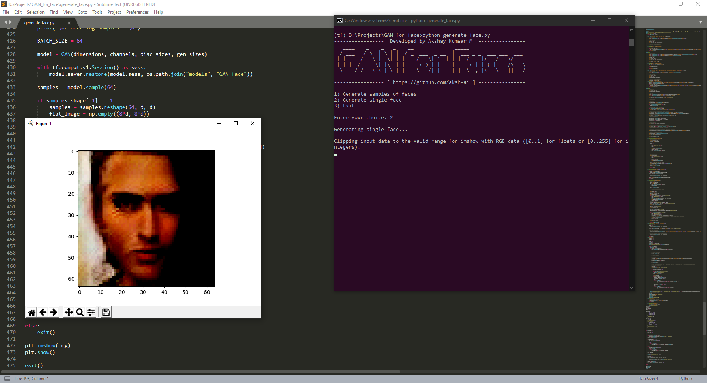
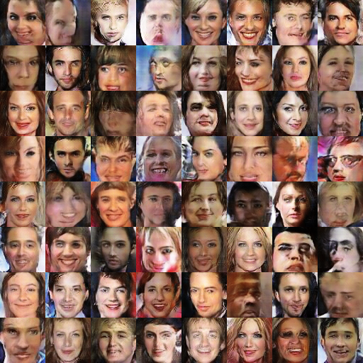
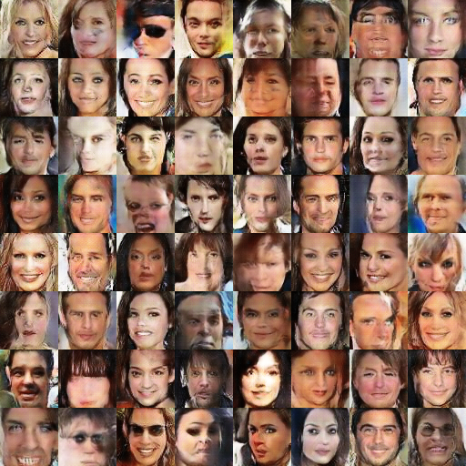
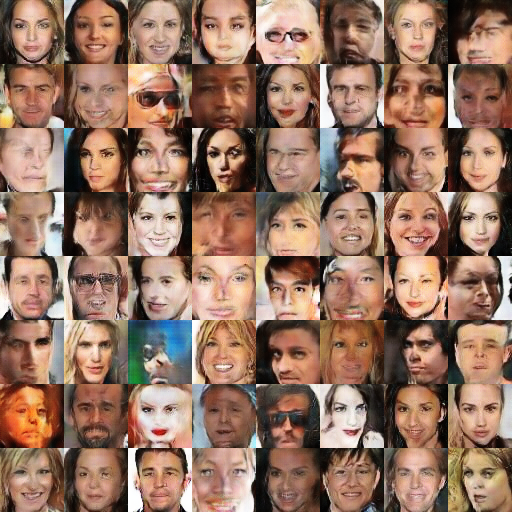
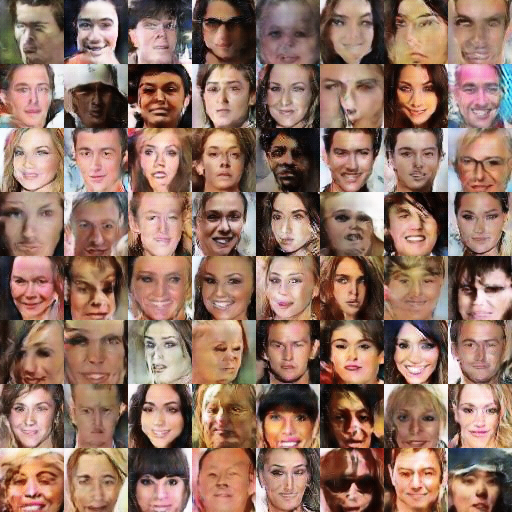
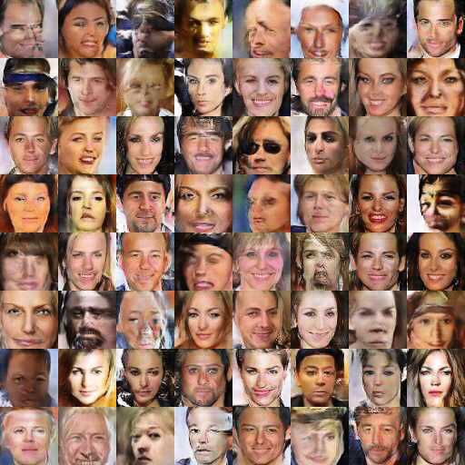

# Deep Convolutional Generative Adversarial Network

Generative Adversarial Network (GAN) for generating human faces using Neural Networks with Tensorflow. This project is based on the [DCGAN Paper](https://arxiv.org/abs/1511.06434).

## Usage

Download the [generative model](https://drive.google.com/open?id=1SkJqtVYX3eDs_9yg9G0C7xaiYCSgNQNc) from this drive link and place it under the same directory where the other files of this repository are located.

* Download the dataset from the link given in Dataset header in this README file. Run the [crop_resize/py](crop_resize.py), for cropping, resizing and saving the necessarily formatted new faces. Run the following command:

    * `python crop_resize.py`

* Run the [GAN_for_face.ipynb](GAN_for_face.ipynb) Interpreted Python notebook file for training and saving the Generative model. From within the folder run the following command:

    * `jupyter notebook`

    * Open the **.ipynb** file and run all the cells.

* Run [generate_face.py](generate_face.py) to generate faces as batches or a single face based on your choice:

    * `python generate_face.py`

## Results of this project

* Test 1

* Test 2

* Generated set of images - 1

* Generated set of images - 2

* Generated set of images - 3

* Generated set of images - 4

* Generated set of images - 5

Jump to the [notebook](GAN_for_face.ipynb) for more details.

## Dataset

[CelebA](http://mmlab.ie.cuhk.edu.hk/projects/CelebA.html) dataset was used for this project.

There were some problems with the dataset due to decompression of the ZIP file and few existing details in the dataset that weren't necessary.

So I used [crop_resize.py](crop_resize.py) script to detect faces present in the dataset, crop them and save them in 64x64 resolution by resizing.

## Environment

* Windows 10 OS 64-bit
* Python 3.6.8 64-bit
* NVIDIA GTX 1050 Ti 4GB GPU
* CUDA 10.0 and CuDNN 7.0
* 8 GB DDR4 RAM
* Tensorflow 1.15.0 GPU Version
* Jupyter Notebook
* Sublime Text

## Requirements

Python 3 is required. Required libraries are:

* Numpy
* Scipy
* Tensorflow 1.15.0
* Matplotlib
* GLOB

Install the required libraries using the [pip](https://pip.pypa.io/en/stable/) package manager and requirements.txt file.

For pip version 19.1 or above:

~~~bash
pip install -r requirements.txt --user
~~~

or

~~~bash
pip3 install -r requirements.txt --user
~~~

## Future Scopes

The DCGAN model was used to produce images of human faces. Will be improving the model and will be deploying altogether as a website where a new human face will be generated everytime a person visits the webpage.